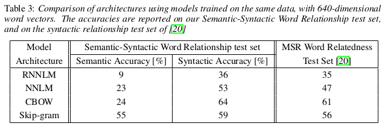
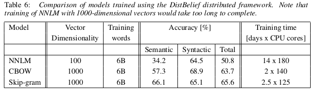

Reading Notes
===================

Paper List
-------------------

- NLP

    - :ref:`Efficient Estimation of Word Representations in Vector Space`

- Blockchain

    - :ref:`On Availability for Blockchain-Based Systems`
    - :ref:`A Byzantine Fault-Tolerant Ordering Service for the Hyperledger Fabric Blockchain Platform`
    - :ref:`Hyperledger Fabric: A Distributed Operating System for Permissioned Blockchains`
    - :ref:`Analyzing Performance in Blockchain-Based Systems`

- Recommendation System

    - :ref:`Personal Recommendation Using Deep Recurrent Neural Networks in NetEase`

.. _Efficient Estimation of Word Representations in Vector Space:

Efficient Estimation of Word Representations in Vector Space
>>>>>>>>>>>>>>>>>>>>>>>>>>>>>>>>>>>>>>>>>>>>>>>>>>>>>>>>>>>>

传统方法解决NLP语法/语义问题的时候通常是没有考虑单词之间的相关性, 这样的话(1)对于语料库的质量要求比较高, 同时(2)在训练上通常用小于million级别的词库(limitation).

作者先回顾了传统的模型(NNLM和RNNLM), 其限制主要在于映射层到隐含层的计算复杂度大, 对此提出了CBOW和Skip-gram模型, 实验表明其计算复杂度和准确率都优于前者.

- NNLM(Feedforward Neural Net Language Model)模型包含四层(输入层、映射层、隐含层、输出层), 其计算复杂度主要在 **映射层** 到 **隐含层** 之间的计算, 而且需要指定上下文的长度.

        :math:`Q=N\times D+N\times D\times H+H\times V`

    --> :math:`Q=N\times D+N\times D\times H+H\times log_2{V}` (用平衡二叉树优化)

    文中给出了一个参考, 当输入大小N=10的时候, 映射层大小 :math:`P(N\times D)` 通常取500-2000, 隐含层大小H通常取500-1000. 这样的话即使优化了输出的大小 :math:`(V->log_2{V})` , 还是没有解决关键的地方

- RNNLM(Recurrent Neural Net Language Model)模型被提出用来改进NNLM模型，**去掉了映射层** ，只有输入层、隐含层和输出层，计算复杂度来源于上一层的隐含层到下一层隐含层之间的计算.

        :math:`Q=H\times H+H\times V`

    --> :math:`Q=H\times H+H\times log_2{V}` (用平衡二叉树优化)

作者提出了 **CBOW** (Continuous Bag-of-Words Model) 和 **Skip-gram** (Continuous Skip-gram Model) 模型, 其去掉了隐含层, 主要的计算复杂度依赖于softmax normalization.

    |word2vec|

    .. |word2vec| image:: ../assets/word2vec.png
        :width: 400px
        :align: middle

- **CBOW** : 与NNLM不同的是, 隐含层被移除了, 并且映射层会共享; 跟标准的词袋(bag-of-words)模型不同的是,该模型用连续的分布来代表上下文

    - 计算复杂度为 :math:`Q = N \times D + D \times log_2{V}`

- **Skip-gram** : 跟CBOW相似, 不过 `It tries to maximize classification of a word based on another word in the sam sentence`. 用单前的词输入到映射层的对数线性(log-linear)分类器中, 并预测给定范围的词(上下文)

    - 计算复杂度为 :math:`Q = C \times (D + D \times log_2{V})`

相比于传统的RNNLM和NNLM, 作者提出的两个模型去掉了隐含层, 因此计算复杂度降低了不少, 同时可以在更大的训练集上训练(billion级别). 实验结果表明在语法和语义任务上准确率大大提高

|word2vec_result|

在训练时候作者是用 `DistBelief` 分布式框架, 速度有不少的提升(主要是计算复杂度降低了)

|word2vec_train|

- 作者训练的时候用了大量的CPU核心, 虽然比传统的模型可以训练维度更大的数据, 速度也更快. 考虑到现在的设备条件, 可以尝试用GPU加速训练.(已有人做过相关的工作)

- 值得注意一点的是, 作者是以单个词为单位的, 如果出现一些相关性强的短语(如 `New York` ), 可能表现就没那么好了, 对整体的准确率也有可能产生一定的影响. 在以后的工作中可以考虑一些类似的情况, 对数据进行预处理或者修改模型的结构.

.. _On Availability for Blockchain-Based Systems:

On Availability for Blockchain-Based Systems
>>>>>>>>>>>>>>>>>>>>>>>>>>>>>>>>>>>>>>>>>>>>

`发表在SRDS 2017 (CCF B)`

偏分析性的一篇文章. 作者以 `Ethereum <https://www.ethereum.org/>`_ 为例, 在公链上收集了大量的交易数据, 用于分析在区块链中对交易最终确认时间(commit times)产生消极影响的原因, 最后提出了一个中断机制(中断/撤回交易), 以优化用户体验.

- 作者从Ethereum公链上收集了大量的交易(每次实验大概是 :math:`3\times 10^{5}` 个交易), 首先分析了 `locktimes` 和 `maximum gas`, 得到其不是 `orphan` 块产生的主要原因. 而最有可能对commit产生影响的是 `network connectivity` , `gas price` 和 `gas limit`

- 作者在三个场景中测试其中断(Abort)机制, 实验表明其提出的中断机制可以有效地(:math:`100\%`)中断这三种情况下的交易:

    (1) A transaction does not get included in the usual period of time (交易被include的时间过长)
    (2) A client changes its mind and decides to roll-back the issued transaction (撤回交易)
    (3) A transaction is in indefinite pending state due to insufficient funds (资金不足导致交易陷入无限等待状态)

    - 在(1)中, 设定最长等待的时间为10分钟(根据前文的统计设定的), 提交了100个低于市场费率(:math:`mr, market\ rate`) (:math:`0, 0.1\times mr, \dots, 0.9\times mr`)的交易. 如果交易在10分钟内没有被包含的话, 那么就发送一个交易费率为 :math:`mr` , value为 :math:`0` 的交易到地址 0x0 (也就是空白交易).

    - 在(2)中, 跟场景(1)相似, 不过 **最大容忍10分钟** 改成了 **等待3分钟后** (模拟交易发起人在3分钟后想撤回交易)

    - 场景(3), 假设nonce 为 :math:`n` 时账户余额为 :math:`k` , 准备两个交易

        +-------------------------+---------------------------+
        |    :math:`Tx_1` (n+1)   |    :math:`Tx_2` (n+2)     |
        +=========================+===========================+
        |:math:`\frac{1}{1000}k`  |:math:`\frac{999}{1000}k`  |
        +-------------------------+---------------------------+
    
        先广播 :math:`Tx_2` , 5秒后广播 :math:`Tx_1`, 这样会因余额不足而导致死锁, 此时发送一个空白的、nonce为n+2的交易去中断 :math:`Tx_2`, 中断用时中位数为45秒

- 比特币中需要6个区块才能 **最终确认** 交易, 以太坊则需要12个区块(这个数字依赖于事物/交易的价值、挖矿的开销和攻击的威胁性), 这意味着攻击者难以控制足够的算力来破坏/改变当前的共识(`51%攻击`). 文中也提到一个使用少于51%的算力来攻击的工作. (对于区块链的攻击一般都是在网络层上的攻击, 基本没有对核心的加密算法的攻击.)

- 两次时间的时间间隔有点大了(2016.11, 2017.04), 以太坊的交易可能会因为整体的网络情况而有所不同.

- 可以模仿作者的思路在更多的网络上进行测试, 或者制定一个标准, 对比不同链的性能.

- 实验中作者修改了最大连接的节点数为500(默认是25), 因此在实验时大都能连接到400个节点. 这在中断机制的实验中为作者的节点提供了有利的条件, 使得 :math:`T_{x_{abort}}` 更快地被广播. 因为以太坊出块的速度是相对稳定的, 这样子的话更容易实现中断. (但实际中默认是最大连接25个节点, 中断的成功率可能没实验中的效果这么好)

.. _A Byzantine Fault-Tolerant Ordering Service for the Hyperledger Fabric Blockchain Platform:

A Byzantine Fault-Tolerant Ordering Service for the Hyperledger Fabric Blockchain Platform
>>>>>>>>>>>>>>>>>>>>>>>>>>>>>>>>>>>>>>>>>>>>>>>>>>>>>>>>>>>>>>>>>>>>>>>>>>>>>>>>>>>>>>>>>>>>>>>

nothing here =.=

.. _Hyperledger Fabric\: A Distributed Operating System for Permissioned Blockchains:

Hyperledger Fabric: A Distributed Operating System for Permissioned Blockchains
>>>>>>>>>>>>>>>>>>>>>>>>>>>>>>>>>>>>>>>>>>>>>>>>>>>>>>>>>>>>>>>>>>>>>>>>>>>>>>>>>>>>>>>

nothing here =.=

.. _Analyzing Performance in Blockchain-Based Systems:

Analyzing Performance in Blockchain-Based Systems
>>>>>>>>>>>>>>>>>>>>>>>>>>>>>>>>>>>>>>>>>>>>>>>>>

nothing here =.=

.. _Personal Recommendation Using Deep Recurrent Neural Networks in NetEase:

Personal Recommendation Using Deep Recurrent Neural Networks in NetEase
>>>>>>>>>>>>>>>>>>>>>>>>>>>>>>>>>>>>>>>>>>>>>>>>>>>>>>>>>>>>>>>>>>>>>>>

本文提出一种用 **DRNN** (Deep Recurrent Neural Networks)和 **FNN** (Feedforward Neural Network) 来对用户网购的行为进行预测和实时推荐的方法. 该方法突破了传统的一些方法(如CF, 协同过滤)的限制, 可在线学习和实时训练, 并且准确率也大大提升.

对于传统的方法:

    - 不能做到实时推荐的效果
    - 准确率相对较低

Challenge:

    - 输入向量大(用户可能访问多个页面)
    - 模型需要对用户实时访问/顺序足够敏感和有效
    - 模型需要在线学习, 速度要足够快

- 在DRNN中, 因为用户访问的可能有多个网页, 因此把之前的/超出范围(n)的浏览记录合并成一个history state, 同时加上当前的一些浏览state作为输入. 其中history state合并为:

.. math::
    \bar{V} = \sum_{i=0}^{x-n}\epsilon_{i}V_{i},\ \epsilon_{i}=\frac{\theta(p_i)}{\sum_{j=i}^{x-n}\theta(p_j)}

|   其中, :math:`V_i` 是页面 :math:`p_i` 的向量, :math:`\epsilon_{i}` 是旧状态的衰减因子

    - 与标准的DRNN不同的是:
        - 模型是用来跟踪(`track`)用户的访问路径(用户到他所需产品的路径)
        - 如果序列过长, 就把历史状态合并成一个 `history state`. 在计算量和准确率之间权衡.
        - 用一个FNN模型来模型CF的工作, 对用户最终购买的产品进行预测

- FNN的作用跟传统的协同过滤相似, 根据用户的购买记录对用户的最终购买的产品进行预测

|   最终, 两个模型合并输出最终的预测, 得到用户购买第 :math:`i` 个商品的概率为:

.. math::
    P(i)=\frac{f(\sum_{x=0}^{E-1}(w_{i}^{L_0}a_{L_{0}}(t)+b_{L_{0}}(t))+\sum_{x=0}^{\bar{E}-1}(\bar{w}_{i}^{L_1}\bar{a}_{x}^{(L_1)}+b_{x}^{(L_1)}))}
    {\sum_{x}f(\sum_{x=0}^{E-1}(w_{i}^{L_0}a_{L_{0}}(t)+b_{L_{0}}(t))+\sum_{x=0}^{\bar{E}-1}(\bar{w}_{i}^{L_1}\bar{a}_{x}^{(L_1)}+b_{x}^{(L_1)}))}

.. - 即使协同过滤(CF)在推荐相关的工作表现得比较好,但是这是建立于历史数据之上,缺乏用户的选择.因此作者提出了用RNN来做推荐的模型.

- 在实验中, 文中提到 `Caffe 1.0` 是没有RNN模型的, 所以通过 `share weights` 的方法将CNN转换成RNN. 文中给出了生成代码(``CodeGen(int w, int l, int h)``)的算法, 改算法可以根据输入的width, length 和 height来生成特定的RNN网络, 并结合遗传算法(``GenTune(int w, int l, int h)``)对其进行调参优化